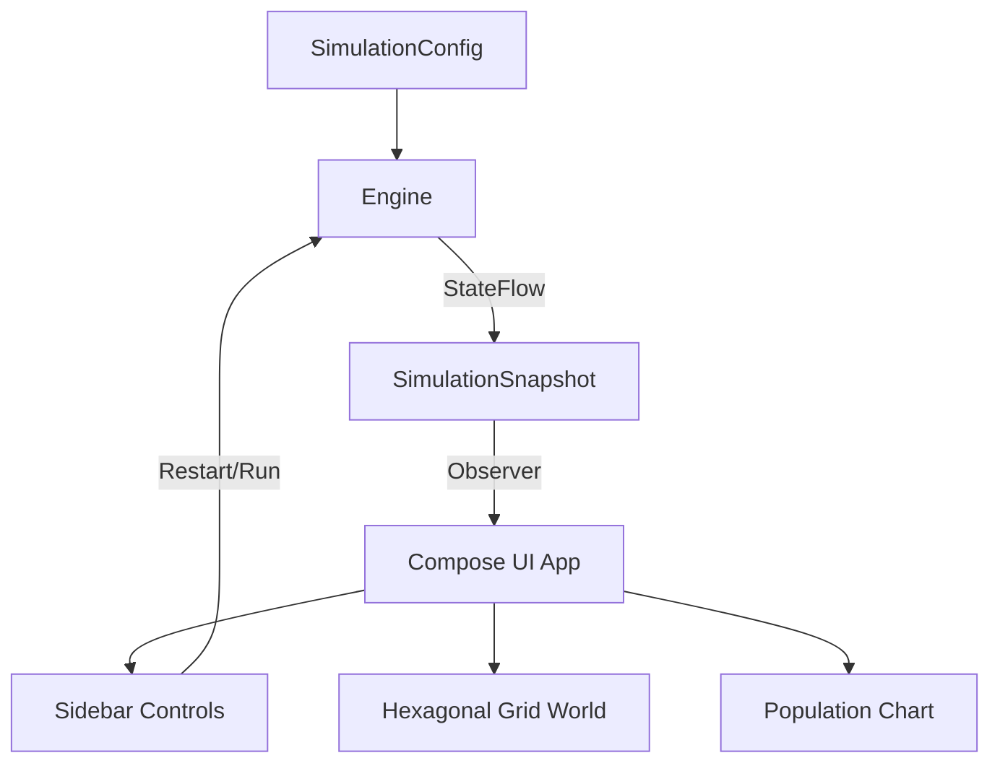

# Final Report: Trophic Food Chain Simulation under the 10% Energy Transfer Law

## Course: Agent Systems (Systemy Agentowe)

**AGH University of Science and Technology**  
**Department of Computer Science**

---

### Section A: Title Page & Group Composition (a)

- **Topic:** Spatial, Energy-Explicit Agent-Based Simulation of a 5-Level Food Chain Under Lindeman's 10% Law
- **Group Members:**
  - Eryk Hadała
  - Hieronim Koc
  - Kacper Drożdż
- **Date:** June 2026
- **OS Target:** macOS / Desktop (JVM)
- **Language:** Kotlin / Compose Multiplatform

---

### Section B: Problem Description (b)

In ecological systems, the flow of energy between trophic levels is governed by the laws of thermodynamics. Raymond Lindeman (1942) formulated the **ten-percent law of trophic efficiency**, which states that only about 10% of the energy stored as organic matter in one trophic level is transferred and incorporated into the biomass of the next level. The remaining 90% is lost through metabolic processes, respiration, movement, heat dissipation, and waste.

#### Ecological Implications

The 10% bottleneck imposes strict limits on ecosystems:

1. **Pyramid of Energy and Biomass:** The available energy decreases exponentially with each ascending step, leading to a pyramid where apex predators possess a fraction of the energy budget available to primary producers.
2. **Food Chain Length:** Because energy decreases exponentially ($E_n = E_1 \cdot \gamma^{n-1}$, where $\gamma \approx 0.10$), trophic chains are rarely longer than 5 levels. Beyond this, the energy required to hunt exceeds the energy harvested.
3. **High Vulnerability of Apex Predators:** Organisms at the 5th trophic level (quaternary consumers / apex predators) operate under a severe caloric deficit. Their population densities are naturally extremely low, making them highly susceptible to extinction due to minor fluctuations at lower levels (bottom-up trophic cascades).

#### The Research Question

Our agent-based model (ABM) seeks to answer:

> **Under the harsh constraints of Lindeman's 10% energy law, can a 5-level spatial food chain persist, and what are the primary biological and behavioral factors that determine the survival probability and persistence of the fifth trophic level (the apex predator)?**

We measure:

- **Persistence (survival time in ticks):** How long each level remains extant before extinction.
- **Survival Fraction:** The probability of a level surviving to the end of a long simulation (1200 ticks) across multiple random seeds.
- **Population Dynamics:** The occurrence of Lotka-Volterra-like oscillations, top-down collapses, or stable coexistence.

We vary:

- **Energy transfer efficiency ($\gamma$):** 5% to 30%.
- **Metabolic rates:** Via a scaling multiplier (0.6 to 1.4).
- **Steering behaviors:** The presence of peer herding (flocking) and prey gradient foraging.

---

### Section C: Literature Review: State of the Art (c)

To contextualize our approach, we analyze three distinct paradigms of multi-agent modeling under severe energy constraints:

#### 1. Behavioral Approach: Multi-Agent Reinforcement Learning (MARL)

- **Reference:** Tsutsui et al. (2024), _Collaborative hunting in artificial agents with deep reinforcement learning_, eLife.
- **Core Paradigm:** Deep Reinforcement Learning (Deep RL).
- **Summary:** The authors show that when single-predator hunting is too energy-intensive, and food-sharing incentives are introduced, cooperative hunting behaviors emerge. Agents spontaneously divide into distinct roles (chaser and ambusher) without hardcoded rules, optimizing their motion trajectories to conserve energy.
- **Relevance to Implementation:** Demonstrates how advanced path navigation helps conserve energy. In our model, this is implemented as behavioral steering vectors in `Agent.Consumer` (`gradientForaging` and `herding` in `Agent.kt`), allowing predators to optimize their movement toward prey density clusters rather than wandering randomly.

#### 2. Evolutionary Approach: Co-Evolutionary Multi-Agent System (Co-EMAS)

- **Reference:** Dreżewski and Siwik (2007), _Co-Evolutionary Multi-Agent System with Predator-Prey Mechanism for Multi-Objective Optimization_.
- **Core Paradigm:** Co-evolutionary Algorithms & Resource-Based Agent Systems.
- **Summary:** Traditional evolutionary algorithms suffer from premature convergence. Co-EMAS addresses this by introducing ecological competition between prey (candidate solutions) and predators (which eliminate Pareto-dominated prey). Energy acts as the sole selection pressure; agents cannot reproduce without an energy surplus, and die upon starvation.
- **Relevance to Implementation:** Directly serves as the core paradigm of our simulation. Every agent in `Agent.kt` maintains an individual `energy` field. Metabolic rates subtract energy each tick, consumption of prey transfers a fraction of energy, and agents reproduce by splitting energy (paying `reproductionCost` to spawn a child with initial energy in `Agent.Consumer.update`) or die of starvation when `energy <= 0.0`, exactly matching the decentralized resource-based system of Co-EMAS.

#### 3. Cognitive Approach: LLM Ecologies (Generative Agents)

- **Reference:** Paolo et al. (2026), _Emergence and Analysis of Open-endedness in LLM Ecologies_.
- **Core Paradigm:** Large Language Models (LLM API as agent controllers).
- **Summary:** The TerraLingua simulator models agents with persistent environmental artifacts. Given the thermodynamics of high trophic levels, populations are small. Agents utilize zero-shot LLM reasoning, memory, and textual cues to plan and pass down cultural knowledge (e.g., warning others of depleted zones), bypassing the "trial-and-error" mortality of RL.
- **Relevance to Implementation:** Forms the baseline for our cognitive extensions discussed in **Section G (Future Research)**. Since LLMs are computationally heavy and slow, our active codebase focuses on basic steering behaviors, leaving LLM-based zero-shot planning for future work on L5 apex populations.

#### Comparison Table of Potential Approaches

| Feature                         | Co-EMAS (Dreżewski & Siwik)                                             | MARL Cooperation (Tsutsui et al.)                              | LLM Ecologies (Paolo et al.)                                       |
| ------------------------------- | ----------------------------------------------------------------------- | -------------------------------------------------------------- | ------------------------------------------------------------------ |
| **Main AI Paradigm**            | Co-evolutionary Algorithms                                              | Deep Reinforcement Learning                                    | Generative AI / Cognitive Models                                   |
| **Adaptation Method**           | Generational (genotype mutation/crossover)                              | Behavioral (lifetime trial-and-error optimization)             | Cognitive (zero-shot reasoning and planning via LLM API)           |
| **Energy Management**           | Decentralized resource. Required to reproduce; depletion causes death.  | Scalar reward function mathematically optimized by neural net. | Strategic budget analyzed logically (e.g., memory of past hunts).  |
| **Response to 10% Energy Rule** | Generational evolution of efficient physical traits (lower metabolism). | Learning optimal pursuit vectors and coordinated maneuvers.    | Real-time planning, communication, and mapping to conserve energy. |

---

### Section D: Agent Definition & Approach (d)

Our implementation is a **spatially explicit, resource-based Agent-Based Model (ABM)**. The world consists of a continuous 2D space of size $W \times H$ pixels, overlaid on a hexagonal grid used to build a spatial index for local query optimization.

#### 1. Trophic Levels & Agent Classes

The agents are structured using a sealed hierarchy:

1. **`Agent.Producer` (L1):** Grass / Autotrophs. Stationary, undergoes photosynthesis, and reproduces via local seed dispersal.
2. **`Agent.Consumer` (L2 - L5):** Heterotrophs. Mobile, pay metabolic costs, chase prey, and flee predators.
   - **L2 (Primary Consumer):** Herbivore. Eats L1, fled by L3.
   - **L3 (Secondary Consumer):** Small Carnivore. Eats L2, fled by L4.
   - **L4 (Tertiary Consumer):** Large Carnivore. Eats L3, fled by L5.
   - **L5 (Quaternary Consumer):** Apex Predator. Eats L4, has no natural predators.

#### 2. Agent State Variables & Species Parameters

Each individual agent maintains:

- $\mathbf{p} = (x, y) \in \mathbb{R}^2$: Spatial position.
- $E \in [0, E_{\text{max}}]$: Current internal energy budget.

Tunable parameters are stored per level in `SpeciesParams` within `SimulationConfig.kt`:

$$
\begin{aligned}
E_{\text{max}} &: \text{Max capacity} \\
E_{\text{init}} &: \text{Initial energy of offspring} \\
M_r &: \text{Metabolic rate per tick (cost of living)} \\
T_{\text{repro}} &: \text{Reproduction threshold} \\
C_{\text{repro}} &: \text{Reproduction cost paid by parent} \\
R_{\text{per}} &: \text{Perception radius} \\
v &: \text{Movement speed (pixels per tick)} \\
R_{\text{regrow}} &: \text{Photosynthesis energy gain per tick (L1 only)} \\
P_{\text{spawn}} &: \text{Dispersal probability per tick (L1 only)}
\end{aligned}
$$

#### 3. Energy Balance and Lindeman's Rule

At each tick, a consumer $i$ of level $n$ updates its energy:

$$E_i \leftarrow E_i - M_r$$

If $E_i \le 0$, the agent dies of starvation.
If a predator $i$ of level $n$ captures a prey $j$ of level $n-1$ (distance $d(i, j) \le d_{\text{consume}} = 14$ px):

$$E_i \leftarrow \min(E_{\text{max}}, E_i + \gamma \cdot E_j)$$

where $\gamma$ is the **energy transfer yield** (nominally $0.10$, representing the 10% rule). The prey $j$ is immediately killed and removed from the simulation.

If $E_i \ge T_{\text{repro}}$, the agent reproduces:

- Parent energy: $E_i \leftarrow E_i - C_{\text{repro}}$
- Offspring is spawned at a random nearby location with starting energy $E_{\text{init}} = C_{\text{repro}}$.

#### 4. Spatial Indexing

To perform efficient local queries, the simulator uses a hexagonal spatial hash map in `SpatialIndex.kt`. The continuous coordinate $\mathbf{p}$ is mapped to axial hexagonal coordinates $(q, r)$. When an agent scans its surroundings, it only inspects the hexagonal cells within its perception radius $R_{\text{per}}$, reducing the neighborhood search complexity from $\mathcal{O}(N^2)$ to $\mathcal{O}(N)$.

#### 5. Behavioral Steering Logic (Vector Model)

Consumers move by computing a blended steering vector $\mathbf{v}_{\text{desired}}$ at each tick:

1. **Predator Avoidance (Fleeing):** If predators (level $n+1$) are within $R_{\text{per}}$, the agent ignores food and runs. The avoidance vector is weighted by the inverse square of the distance:
   $$\mathbf{v}_{\text{flee}} = \sum_{k \in \text{predators}} \frac{\mathbf{p} - \mathbf{p}_k}{d(i, k)^2}$$
2. **Prey Acquisition (Hunting):**
   - _Nearest Neighbor:_ If `gradientForaging` is disabled, the agent steers directly toward the closest prey $j$:
     $$\mathbf{v}_{\text{hunt}} = \frac{\mathbf{p}_j - \mathbf{p}}{\|\mathbf{p}_j - \mathbf{p}\|}$$
   - _Gradient Foraging:_ If enabled, the agent calculates a density-weighted pull towards the centroid of all visible prey:
     $$\mathbf{v}_{\text{hunt}} = \sum_{j \in \text{prey}} \frac{\mathbf{p}_j - \mathbf{p}}{d(i, j)^2}$$
3. **Peer Grouping (Herding):** If `herding` is enabled, the agent blends cohesion (pull toward peers' centroid) and separation (push away from too-close peers):
   $$\mathbf{v}_{\text{herd}} = w_c \cdot \mathbf{v}_{\text{cohesion}} + w_s \cdot \mathbf{v}_{\text{separation}}$$
   where $\mathbf{v}_{\text{separation}}$ odpycha agentów przy odległościach poniżej $18$ px.

The final position update is:

$$\mathbf{p} \leftarrow \mathbf{p} + v \cdot \text{normalize}(\mathbf{v}_{\text{desired}})$$

If no targets are detected, the agent falls back to a **random walk (wander)**.

---

### Section E: Detailed Description of the Simulator (e)

The application is written in Kotlin using the Jetpack Compose Multiplatform framework.

#### Software Architecture

The simulator uses a decoupled model-view-controller layout. The ecological engine in `Engine.kt` runs headlessly on a background thread. It publishes immutable snapshots `Snapshot.kt` via Kotlin `StateFlow`. The GUI observes this flow and triggers recomposition safely, eliminating race conditions.



#### GUI Layout and Visual Codes

The user interface is divided into three distinct panels:

1. **Sidebar Controls (Left):** Allow runtime adjustment of simulation speed and toggling pause/resume. Major configurations (world bounds, seed, initial populations, grass capacity, metabolic scale, energy transfer yield, and behavioral toggles) are set here and applied upon clicking **Run/Restart**.
2. **Hexagonal Grid World (Center/Top):** Displays a scrollable viewport of the 2D world. Agents are represented as colored circles.
   - **Color Maps Trophic Level:** 🟢 L1 (Producer), 🟡 L2 (Herbivore), 🟠 L3 (Small Carnivore), 🔴 L4 (Large Carnivore), 🟣 L5 (Apex Predator).
   - **Size Scales with Trophic Level:** L5 circles are significantly larger than L2 circles.
   - **Brightness Mapped to Energy:** Circle opacity is proportional to the agent's current energy ratio ($E / E_{\text{max}}$). Starving agents fade out before disappearing.
   - **Live Counters:** Displays a text overlay with the current tick, total agents, and per-level counts.
3. **Population Chart (Bottom):** Plots the population curves of all 5 levels over the last 600 ticks. The **Y-axis is log-scaled** to make L5 (populations of 1-5) clearly readable alongside L1 (populations of 200+).

#### Running the Simulator

To build and execute the application locally:

```bash
./gradlew :composeApp:run
```

#### Sample Work Session Workflow

1. **Initialize Environment:** Upon startup, the Sidebar is prefilled with baseline parameters. Click **Run** to spawn the initial populations.
2. **Observe Dynamics:** Watch the Lotka-Volterra waves propagate. L1 and L2 oscillate; L3 and L4 hunt. Notice the large L5 circles slowly gliding.
3. **Analyze Bottlenecks:** Observe that under defaults, L4 collapses around tick 300, leading to the starvation of L5.
4. **Parameter Tweak:** Adjust **Energy Transfer %** from 10% to 25%, and reduce **Metabolism** to 0.7. Click **Restart**. Observe that L5 survives significantly longer.
5. **Data Export:** Click **Export CSV** to write the population timeline into a local file `foodchain_populations_tick<N>.csv` for post-simulation analysis.

---

### Section F: Data Analysis and Results Interpretation (f)

To rigorously evaluate the system's thermodynamics, we executed headless parameter sweeps using the headless test runner in `Sweep.kt` over 12 unique random seeds for 1200 ticks per configuration.

#### 1. Trophic Level Persistence vs. Energy Transfer Yield ($\gamma$)

We varied the Lindeman energy transfer coefficient $\gamma$ from 5% to 30%. The table shows the mean persistence tick (time before extinction) for each trophic level:

| Yield ($\gamma$) | L1 Persist | L2 Persist | L3 Persist | L4 Persist | L5 Persist |
| ---------------- | ---------- | ---------- | ---------- | ---------- | ---------- |
| **0.05 (5%)**    | 956.58     | 698.25     | 325.33     | 400.58     | **612.00** |
| **0.08 (8%)**    | 772.92     | 649.50     | 353.67     | 408.33     | **633.75** |
| **0.10 (10%)**   | 828.33     | 604.33     | 402.00     | 410.67     | **667.83** |
| **0.15 (15%)**   | 417.17     | 586.08     | 423.50     | 411.00     | **696.08** |
| **0.20 (20%)**   | 754.92     | 538.58     | 520.42     | 377.17     | **767.17** |
| **0.25 (25%)**   | 577.67     | 508.00     | 572.67     | 413.08     | **823.25** |
| **0.30 (30%)**   | 342.75     | 520.42     | 543.17     | 479.17     | **821.58** |

_Note: The survival fraction at tick 1200 for all consumer levels (L2-L5) was 0.0, indicating that total ecosystem collapse is inevitable in the long run. However, the timing of the collapse is highly dependent on $\gamma$._

##### Interpretation:

- **The Apex Predator Lifeline:** L5 persistence is strictly monotonic with energy transfer yield. At 5% yield, L5 dies out by tick 612; at 30% yield, survival extends to tick 821. Efficient transfer allows the top of the pyramid to stave off starvation longer.
- **The Grass Survival Paradox:** Lower yield (5-10%) results in _higher_ L1 grass persistence (956.58 ticks for 5% vs 342.75 ticks for 30%). This is an **herbivore-release effect**: when energy transfer is inefficient, L2-L4 populations remain small and collapse early, releasing the grass from intense grazing pressure. Conversely, at 30% yield, predators are highly efficient, maintaining large herbivore populations that completely overgraze the grass, driving it to extinction early (tick 342.75) and causing a bottom-up crash.

#### 2. Influence of Steering Behaviors (Herding & Gradient Foraging)

We tested the combination of peer herding and gradient foraging at the default 10% yield:

| Herding | Gradient Foraging | L3 Persist | L4 Persist | L5 Persist |
| ------- | ----------------- | ---------- | ---------- | ---------- |
| False   | False             | 374.58     | 354.92     | 668.75     |
| False   | True              | 447.50     | 440.08     | 669.08     |
| True    | False             | 364.83     | 413.75     | 654.42     |
| True    | True              | 378.25     | 435.25     | 649.33     |

##### Interpretation:

- **Middle-Tier Stabilization:** Turning on gradient foraging (moving toward prey clusters instead of a single prey) increases L4 persistence by about 24% (from 354.92 to 440.08). Herding (flocking) also increases L4 persistence to 413.75 ticks.
- **The Apex Insensitivity:** In contrast to L4, **L5 persistence remains almost constant (~649-669 ticks) across all behavioral settings**. This is because L4 collapses around tick 400. Once L4 is extinct, L5 has no food source. Because L5 starts with $E_{\text{init}} = 400$ and consumes $M_r = 0.7$ energy per tick, it takes exactly $400 / 0.7 \approx 571$ ticks to starve. Thus, L5's persistence is a metabolic delay, unaffected by its active hunting behaviors, illustrating the absolute tyranny of the energy pyramid.

#### 3. Influence of Metabolism Multiplier

We scaled the metabolic rates of all consumers (L2-L5) by a factor $M \in [0.6, 1.4]$:

| Metabolism Multiplier | L3 Persist | L4 Persist | L5 Persist  | L5 Survival Fraction |
| --------------------- | ---------- | ---------- | ----------- | -------------------- |
| **0.6**               | 746.17     | 534.58     | **1137.75** | **0.25 (25%)**       |
| **0.8**               | 518.08     | 490.33     | **826.33**  | **0.00 (0%)**        |
| **1.0**               | 465.83     | 342.67     | **657.83**  | **0.00 (0%)**        |
| **1.2**               | 290.92     | 344.42     | **539.83**  | **0.00 (0%)**        |
| **1.4**               | 259.33     | 312.50     | **458.75**  | **0.00 (0%)**        |

##### Interpretation:

- **Metabolism as the Strongest Leverage:** Decreasing metabolism to 0.6 dramatically extends L5 persistence to 1137.75 ticks and yields a 25% survival rate at the end of the simulation. This is the only configuration where L5 successfully coexisted until tick 1200. Lowering the cost of living is mathematically equivalent to broadening the energy base.

---

### Section G: Conclusions & Future Research (g)

#### Major Conclusions

1. **Thermodynamic Inevitability of Collapse:** Without background replenishment of primary producers, spatial ecosystems under Lindeman's law are transient. The system invariably moves toward extinction, beginning with the upper-tier carnivores and ending with herbivore overgrazing.
2. **Apex Fragility:** The quaternary consumer is entirely dependent on the stability of the levels below it. Behavioral optimizations (herding, density foraging) can slow down the collapse of the middle tier, but they cannot save the apex predator once the primary food source disappears.
3. **Metabolic Adaptation vs. Behavioral Optimization:** Evolutionary adaptation towards lower metabolic rates (metabolic slowdown) is far more effective at ensuring long-term species survival than behavioral path optimization under resource scarcity.

#### Future Research Directions

##### 1. Continuous Background Grass Spawning (`backgroundSpawn`)

To establish a true steady-state ecosystem, grass (L1) must have a non-zero probability of spawning in empty cells representing wind-blown seeds or dormant seed banks. This breaks the absorbing state of $0$ grass, allowing the system to undergo cyclic Lotka-Volterra oscillations indefinitely instead of collapsing.

##### 2. Dispersal and Giving-Up Time (GUT)

Currently, agents wander randomly when no prey is visible. Because random walks are diffusive ($\Delta x \sim \sqrt{t}$), agents form frozen clusters in depleted patches. Future models should implement correlated random walks (levy flights) and a "giving-up time" rule, forcing agents to transition to a high-speed dispersal mode if they fail to locate food after $K$ ticks.

##### 3. Machine Learning Integration (Deep RL & LLM)

- **Deep RL Action Selection:** Replacing the hardcoded steering weights with a neural network trained via Deep Q-Networks (DQN) would allow predators to learn complex hunting maneuvers, such as ambushing, flanking, or collective herding.
- **LLM Cognitive Modeling:** For L5 predators, whose populations are very small, we can model decisions via an LLM. The agent logs observations into a text prompt, and the model decides on long-term actions (e.g., "energy is low, avoid hills, sleep to lower metabolism").

#### Ethical Considerations

Modeling artificial life and resource scarcity raises important conceptual questions:

- **Ecological Management Policies:** These simulations highlight that high efficiency in harvesting resources (e.g., yield = 30%) can lead to rapid ecological collapse (the Tragedy of the Commons). Translating this to human resource allocation underscores the necessity of capping consumption to maintain the stability of primary resources.
- **Responsible AI in Ecosystem Modeling:** Using predictive models to guide wildlife conservation or agricultural policy must be handled with care. Models are simplifications; over-reliance on simple thermodynamic simulations could lead to unintended trophic cascades if deployed in real-world wildlife management.
