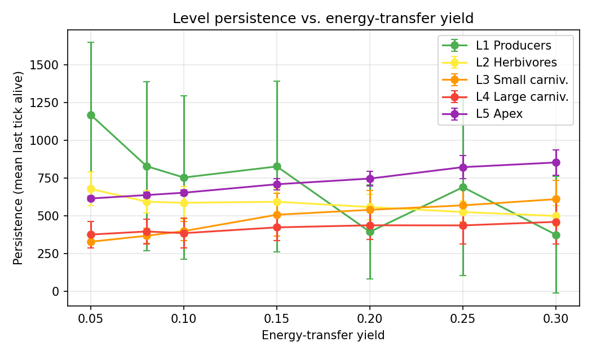
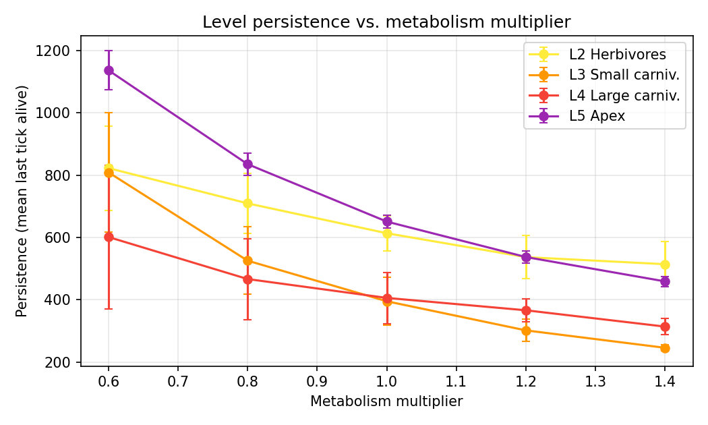
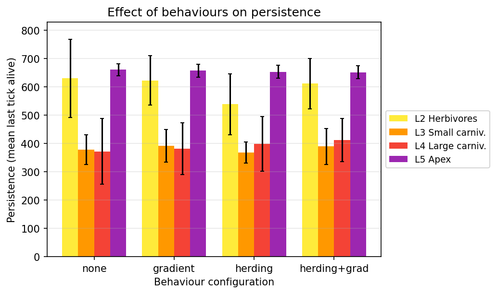

<!-- _class: lead -->
<!-- _backgroundImage: url('assets/bg-title.jpg') -->

# Food Chain with the 10% Energy Rule

## An agent-based model of trophic collapse and apex-predator survival

Eryk Hadała · Hieronim Koc · Kacper Drożdż
Agent Systems

<!--
Speaker (~15s): Our project is an agent-based simulation of a five-level food chain
governed by the ecological 10% energy rule. The question we ask: under that hard rule,
how long can each level survive - and what decides the fate of the apex predator.
-->

---

## The problem & our question

- **Lindeman's 10% rule:** each trophic level passes only ~**10%** of its energy to the level above.
- Five levels: **L1 grass → L2 herbivores → L3 → L4 → L5 apex predator**.
- Energy is lost at every step → the top of the pyramid is the most fragile.

### Research question
> Under the hard 10% rule, **how long does a 5-level chain persist**, and what determines the **survival of the apex predator (L5)**?

<!--
Speaker (~45s): Only a tenth of the energy crosses each level, so a huge producer base
supports a tiny apex. We don't ask "does it reach equilibrium" - we ask how long each
level lasts and which parameters keep the apex alive longest.
-->

---

## Our approach - the agents

- An **agent-based model** (not a cellular automaton): individuals move in **continuous space**.
- Each agent carries **energy** and follows simple per-tick rules:
  - **hunt / flee** (steering), **eat** → gain **+10% of the prey's energy**,
  - **reproduce** above a threshold, **starve** when energy hits zero.
- Producers (L1) photosynthesise and spread up to a carrying capacity.
- A single **deterministic tick loop** updates everyone; births/deaths applied atomically → no double-eating, reproducible per seed.

<!--
Speaker (~60s): Every individual is an agent with an energy budget. Predators steer toward
prey and away from threats; eating transfers exactly 10% of the prey's energy. One central
scheduler steps the world tick by tick, so a given seed always reproduces the same run.
-->

---

<!-- _class: chart -->

## The simulator - live demo

<video src="assets/run_agent_systems_app.mp4" poster="assets/sim-poster.png" controls muted loop></video>

- Colours = trophic levels · brightness = energy · live **population chart** below.
- Sidebar = experiment knobs: **energy-transfer %**, metabolism, behaviours, seed, speed.

<!--
Speaker (~90s): Here is the model running. Watch the bottom chart: grass and herbivores
oscillate, then the upper predators drop out one by one. Every slider on the left is an
experiment knob - energy yield, metabolism, herding - which we sweep next.
-->

---

## Method - measuring persistence

- **Metric - persistence:** the last tick at which a level still has ≥1 individual (longer = survived longer).
- **Headless parameter sweep:** same engine, no GUI; **30 random seeds**, reported as **mean ± SD**.
- **Why timing, not survival?** Without grass regrowth, *empty grass = an absorbing state* → every consumer level eventually collapses. So we measure **how long**, and show the **spread** across seeds.

<!--
Speaker (~30s): We run the engine head-less over a grid of parameters, thirty seeds each,
and report mean plus/minus one standard deviation. Because collapse is inevitable here,
the meaningful number is duration, and the error bars tell us what is signal vs noise.
-->

---

<!-- _class: chart -->

## Result 1 - the 10% bottleneck

- Extinction order **L4 → L3 → L1 → L5 → L2** - the apex **starves last**.
- Higher yield → **longer apex persistence (614 → 853 ticks)**. · *error bars = ±1 SD*

<!--
Speaker (~60s): Middle predators die first - squeezed from both sides. The apex lingers not
because it thrives but because nothing eats it. Crucially, the more efficient the energy
transfer, the longer L5 holds on - a direct readout of the 10% rule.
-->

---

<!-- _class: chart -->

## Result 2 - what keeps the apex alive…

- **Strongest, most robust lever:** L5 lasts **1136 → 459** ticks (×0.6 → ×1.4).
- Monotonic; error bars don't overlap → a real effect.

<!--
Speaker (~45s): The single biggest factor is the cost of living. Halve metabolism and the
apex lasts more than twice as long. The trend is clean and the error bars are tight - this
is a robust result.
-->

---

<!-- _class: chart -->

## …and what doesn't - behaviours

- All four configs overlap within **±1 SD** (L4 ≈ 372–412, SD ≈ 77–117) → no real effect.
- Behaviours change **spatial structure**, not **survival timing**. *(earlier "+28%" was a 15-seed artefact)*

<!--
Speaker (~75s): This is our honesty slide. With more seeds and error bars, the apparent
benefit of herding vanishes into the noise - every configuration overlaps. Emergent
movement changes how agents cluster, but it does not change who survives or for how long.
-->

---

## Conclusions & further work

### Findings
- **Higher trophic level → lower survival probability** - the apex is the most fragile.
- The apex's fate is set by the **level below it**, not by its own behaviour.
- Strongest levers: **metabolism > energy-transfer yield**; behaviours = spatial structure only.

### Further work
- Background grass spawn → recovery and sustained oscillations instead of one-way collapse.
- Trait inheritance + mutation → natural selection / ML directions.

<!--
Speaker (~45s): The take-away is the fragility of the top of the energy pyramid, exactly as
the 10% rule predicts. Next we'd add grass regeneration so the system can recover, and
heritable traits to study selection. Thank you - happy to take questions.
-->
